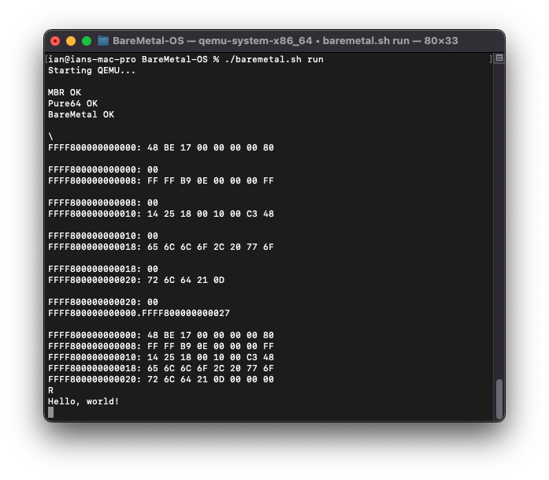

# Wozmon x86-64

## About

An instruction by instruction rewrite of Wozmon in x86-64 for the BareMetal kernel.

<p align="center">
	</img>
</p>

## Prerequisites

The scripts in this repo depend on a Debian-based Linux system like [Ubuntu](https://www.ubuntu.com/download/desktop) or [Elementary](https://elementary.io). macOS is also supported if you are using [Homebrew](https://brew.sh).

- [NASM](https://nasm.us) - Assembly compiler to build the loader and kernel, as well as the apps written in Assembly.

In Linux this can be completed with the following command:

	sudo apt install nasm


## Memory Layout

The BareMetal kernel uses the first 2MiB of RAM. Wozmon runs within the BareMetal kernel memory. All other available RAM is mapped at 0xFFFF800000000000


## Usage

* On startup a `\` will be displayed.

* Wozmon will interpret any hexadecimal value as a memory address. Wozmon will display the memory address and the 8-bit value at that address.

```
1E0000
00000000001E0000: 8A
```

* Entering a hexadecimal value followed by a ':' will allow you to write bytes starting at that memory address.

```
FFFF800000000000: C3
```

* Entering `R` will run the code at the last provided address.


## Test Program #1

* `90` is the `NOP` instruction. The CPU effectively skips to the next instruction.
* `C3` is the `RET` instruction. The CPU returns back to Wozmon.

```
FFFF800000000000: 90 C3
R
```

## Test Program #2

Code doesn't need to be stored and run from `0xFFFF800000000000`.
```
200000: 31 C9 F6 F1
R
```

* `31 C9` is the `XOR ECX, ECX` instruction. This sets the ECX register to 0.
* `F6 F1` is the `DIV CL` instruction. It will divide the AX register by CL.

This program will cause a divide by zero exception that is handled by the BareMetal kernel.


## Test Program #3

```
FFFF800000000000: 48 BE 17 00 00 00 00 80
FFFF800000000008: FF FF B9 0E 00 00 00 FF
FFFF800000000010: 14 25 18 00 10 00 C3 48
FFFF800000000018: 65 6C 6C 6F 2C 20 77 6F
FFFF800000000020: 72 6C 64 21 0D
R
```

* `48 BE 17 00 00 00 00 80 FF FF` is the `MOV RSI, 0xFFFF800000000017` instruction. It loads the RSI register with the address of the string.
* `B9 0E 00 00 00` is the `MOV ECX, 0x0E` instruction. It loads the ECX register with the number of characters we want to output.
* `FF 14 25 18 00 10 00` is the `CALL [0x100018]` instruction. It calls a kernel function for outputting characters.
* `C3` is the `RET` instruction. The CPU returns back to Wozmon.
* The remaining hex bytes contain the string data "Hello, world!"

The text above was generated by the following command (Thanks Ben Eater!):

`hexdump -e '"FFFF800000000%03_ax: " 8/1 "%02X " "\n"' hello.app`

// EOF
